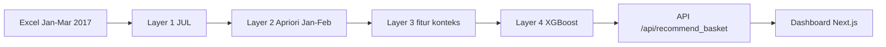

# Integrasi Association Rule Mining (Apriori) dan Extreme Gradient Boosting (XGBoost) untuk Sistem Cerdas Cross-Selling pada Ritel Modern

**Implementasi Data Ritel Lokal 2017**

[](https://www.python.org/)
[](https://fastapi.tiangolo.com/)
[](https://nextjs.org/)
[](https://xgboost.readthedocs.io/)

Dokumentasi ini khusus untuk jejak **toko lokal 2017**. Jejak akademik Instacart, termasuk fitur perilaku pelanggan dan berkas `notebooks/`, dijelaskan di [README.md](README.md). Kedua mode memakai arsitektur yang sama, Apriori lalu XGBoost, tetapi satuan datanya berbeda: Instacart mengikuti pelanggan, toko lokal mengikuti struk anonim.

## Gambaran Umum

Kasir toko mencatat barang per baris jurnal, bukan per identitas pelanggan. Tidak ada `user_id` yang menghubungkan kunjungan hari ini dengan kunjungan minggu lalu. Karena itu sistem tidak boleh mengasumsikan loyalitas member.

Apriori statis menjawab satu pertanyaan: barang apa yang sering muncul bersama di seluruh struk historis. Aturan itu sama untuk setiap jam dan setiap ukuran keranjang. Pendekatan hibrida menaruh aturan itu sebagai fitur, lalu membiarkan XGBoost menimbang konteks struk yang sedang aktif: jam, hari, akhir pekan, dan jumlah barang di keranjang. Rekomendasi di kasir menjadi keputusan per struk, bukan daftar pasangan yang dipukul rata.



## Karakteristik Dataset

Sumbernya tiga berkas jurnal kasir di `dataset_ril/`: `Januari-2017.xlsx`, `Februari-2017.xlsx`, dan `Maret-2017.xlsx`. Masing-masing punya satu lembar `INTRNA` dan 61 kolom yang sama. Gabungan jurnal sekitar **440.900 baris**. Satu baris adalah satu barang di dalam satu bukti, bukan satu struk utuh.

Hanya `TP_TRN = JUL` yang dipakai. Mutasi, penerimaan, rebate, dan adjustment dibuang. Setelah saringan itu tersisa **403.540 baris jual** dan **104.390 struk**.

| Periode | Peran | Baris JUL | Struk `NO_BKT` |
|---|---|---:|---:|
| Januari 2017 | Latih dan penambangan aturan | 136.241 | 35.344 |
| Februari 2017 | Latih dan penambangan aturan | 127.031 | 32.925 |
| Januari + Februari | Training dan mining | 263.272 | 68.269 |
| Maret 2017 | Uji tak terlihat | 140.268 | 36.121 |

Matriks uji Layer 3 bukan 36.121 struk mentah. Satu baris matriks adalah satu pasangan **struk × aturan** yang antecedent-nya sudah ada di struk. Ukuran matriks uji Maret adalah **22.046 baris**, dengan proporsi kelas positif 24,3%. Matriks latih Januari–Februari berukuran **42.946 baris** sebelum SMOTE.

### Pemetaan kolom

| Kolom sumber | Tipe | Dipetakan menjadi | Catatan |
|---|---|---|---|
| `NO_BKT` | teks | `order_id` / identitas struk | Contoh `060102001`. Tidak berulang lintas bulan |
| `ITEM` | teks | kunci produk | Leading zero dipertahankan, misalnya `039390` |
| `NAMA` | teks | nama tampilan | Ejaan terpotong. Nama kanonik adalah ejaan yang paling sering untuk `ITEM` itu |
| `TGL_TRANS` | tanggal | hari dan akhir pekan | Serial Excel atau datetime, dinormalisasi di Layer 1 |
| `JAM` | waktu | `hour_of_day` | Format `HH:MM:SS` |
| `QTY` | angka | jumlah pada baris | Selalu positif pada baris `JUL`. Ukuran keranjang model memakai jumlah `ITEM` unik, bukan jumlah `QTY` |
| `TP_TRN` | teks | saringan populasi | Hanya `JUL` |
| `KEL` | teks | kelompok barang | Tidak masuk delapan fitur model |

`NO_ORD` kosong di seluruh baris, jadi tidak ada pengganti identitas pelanggan.

## Delapan Fitur Konteks Struk

XGBoost toko lokal tidak menerima riwayat member. Delapan kolom berikut, dalam urutan ini, adalah kontrak inferensi `models/xgboost_cross_sell_ril.pkl`.

| Fitur | Arti | Sumber |
|---|---|---|
| `current_basket_size` | Jumlah kode `ITEM` unik pada struk aktif | `nunique(ITEM)` per `NO_BKT`. Pada API keranjang, nilainya `len(basket)` |
| `hour_of_day` | Jam transaksi, 0–23 | `JAM` |
| `day_of_week` | Hari belanja, Senin = 0 sampai Minggu = 6 | `TGL_TRANS` |
| `is_weekend` | 1 jika Sabtu atau Minggu, selain itu 0 | `day_of_week >= 5` |
| `rule_confidence` | Keyakinan aturan Apriori | `confidence` aturan yang antecedent-nya ada di struk |
| `rule_lift` | Lift aturan | `lift` aturan yang sama |
| `antecedent_rate` | Pangsa struk Januari–Februari yang memuat antecedent | Dihitung hanya dari 68.269 struk historis, tidak dari Maret |
| `interest_lift` | Daya tarik aturan pada lalu lintas toko | `antecedent_rate × rule_lift` |

`interest_confidence` tidak dijadikan kolom. Nilai itu hanya mengalikan `antecedent_rate` dengan `rule_confidence`, dua besaran yang sudah berdiri sendiri. `interest_lift` dipertahankan karena lift sudah menormalkan kebetulan.

Label `y = 1` bila consequent juga ada di struk yang sama. Kehadiran consequent tidak masuk ke fitur.

## Arsitektur 5-Layer

Notebook toko lokal berada di `notebooks_ril/`. Folder `notebooks/` tidak dibaca oleh jejak ini.

```text
dataset_ril/*.xlsx
    -> notebooks_ril/layer1_preprocessing_ril.ipynb
    -> outputs_ril/jul_transactions.csv
    -> notebooks_ril/layer2_apriori_ril.ipynb
    -> outputs_ril/apriori_rules_ril.csv
    -> notebooks_ril/layer3_feature_engineering_ril.ipynb
    -> outputs_ril/layer3_train_features.csv
    -> outputs_ril/layer3_test_features.csv
    -> notebooks_ril/layer4_model_training_ril.ipynb
    -> models/xgboost_cross_sell_ril.pkl
    -> notebooks_ril/layer5_inference_ril.ipynb
    -> api.py
    -> web-frontend/
```

### Layer 1 — Prapemrosesan

`notebooks_ril/layer1_preprocessing_ril.ipynb` membaca tiga Excel, mempertahankan `ITEM` dan `NO_BKT` sebagai teks, lalu membuang selain `JUL`. Nama tampilan dipilih dari ejaan `NAMA` yang paling sering untuk tiap `ITEM`. Keluaran: `outputs_ril/jul_transactions.csv`.

### Layer 2 — Apriori Januari–Februari

`notebooks_ril/layer2_apriori_ril.ipynb` menambang 68.269 struk historis.

`min_support = 0,01` hampir tidak menghasilkan pasangan. Pada `0,005` ada 33 barang, tetapi tidak ada pasangan yang mencapai ambang itu. Ambang yang dipakai adalah **`min_support = 0,001`** dan **`min_confidence = 0,1`**. Satu pasangan harus muncul di sedikitnya 69 struk. Hasilnya **138 aturan** satu-ke-satu, disimpan di `outputs_ril/apriori_rules_ril.csv`.

Aturan terkuat: `003332` Fres Soap 70gr Strawberry menuju `019577` Fres Soap 70gr Grape, confidence 0,631 dan **lift 348,32**.

### Layer 3 — Fitur konteks

`notebooks_ril/layer3_feature_engineering_ril.ipynb` menyusun satu baris untuk setiap struk yang sudah memuat antecedent suatu aturan.

| Split | Bulan | Baris | Proporsi kelas 1 |
|---|---|---:|---:|
| Latih | Januari–Februari | 42.946 | 0,2359 |
| Uji | Maret | 22.046 | 0,2430 |

### Layer 4 — Pelatihan dan uji Maret

`notebooks_ril/layer4_model_training_ril.ipynb` menerapkan SMOTE hanya pada data latih. Setelah SMOTE, latih menjadi 65.626 baris seimbang, dan keempat model memakai seluruh baris itu. SVM tidak dilatih karena probabilitasnya tidak praktis pada puluhan ribu baris. Data uji Maret tidak diubah.

Model yang dibandingkan adalah **XGBoost, LightGBM, Random Forest, dan Logistic Regression**. Model integrasi yang disimpan adalah `models/xgboost_cross_sell_ril.pkl`, terpisah dari `models/xgboost_cross_sell_model.pkl` milik Instacart.

### Layer 5 — Inferensi

`notebooks_ril/layer5_inference_ril.ipynb` memuat model toko dan menilai satu baris sungguhan dari matriks uji Maret. Ambang keputusannya 0,50.

API produksi memperluas inferensi itu ke keranjang banyak barang lewat `POST /api/recommend_basket`:

1. Ukuran keranjang = jumlah barang unik pada daftar yang dikirim.
2. Ambil aturan yang antecedent-nya ada di keranjang.
3. Buang aturan yang consequent-nya sudah ada di keranjang.
4. Bentuk delapan fitur untuk setiap aturan yang tersisa.
5. Urutkan `predict_proba` dari yang tertinggi dan kembalikan tiga rekomendasi teratas.

## Hasil Evaluasi pada Maret 2017

Metrik dihitung pada 22.046 baris uji. Precision, recall, dan F1 memakai rata-rata macro.

| Model | Akurasi | Precision Macro | Recall Macro | F1 Macro | AUC-ROC |
|---|---:|---:|---:|---:|---:|
| LightGBM | 77,39% | 0,685 | 0,612 | 0,626 | 0,740 |
| **XGBoost** | **76,91%** | **0,676** | **0,631** | **0,644** | **0,740** |
| Random Forest | 71,32% | 0,639 | 0,664 | 0,646 | 0,741 |
| Logistic Regression | 68,08% | 0,628 | 0,664 | 0,629 | 0,731 |

XGBoost adalah model yang dipasang di kasir. Akurasinya **76,91%** dan AUC-nya **0,740**. Precision macro-nya 0,676, di bawah LightGBM (0,685) dan di atas Random Forest serta Logistic Regression. LightGBM unggul tipis pada akurasi. Random Forest unggul pada F1 macro dan AUC. Tabel ini dibiarkan utuh supaya pemilihan XGBoost dapat dibandingkan, bukan disembunyikan.

Pada laporan kelas XGBoost, kelas positif (consequent memang ada di struk) punya precision 0,537 dan recall 0,361. Ambang keputusan tetap 0,50: di atas ambang, kasir menampilkan **Rekomendasikan ke Pelanggan**; di bawah ambang, **Tidak Perlu Ditawarkan**.

## Panduan Instalasi

### Prasyarat

- Git
- Python **3.11**. `requirements.txt` mengunci NumPy 1.25.2, yang tidak dipakai pada Python 3.12
- Node.js 18 atau lebih baru, hanya untuk dashboard web

Detail lingkungan Apple Silicon dan bentrok Anaconda ada di [README.md](README.md).

### Clone dan lingkungan Python

```bash
git clone https://github.com/bernardbearrrrr/Cross-Selling-Retail.git
cd Cross-Selling-Retail
python3.11 -m venv venv
source venv/bin/activate
python -m pip install --upgrade pip
pip install -r requirements.txt
```

Di Windows, aktivasi memakai `venv\Scripts\activate`.

### Menjalankan ulang notebook

Langkah ini opsional. Artefak latih sudah ada di `outputs_ril/` dan `models/xgboost_cross_sell_ril.pkl`. Jika diulang, jalankan berurutan dari folder proyek:

```bash
source venv/bin/activate
jupyter notebook notebooks_ril/layer1_preprocessing_ril.ipynb
```

Lalu `layer2_apriori_ril.ipynb`, `layer3_feature_engineering_ril.ipynb`, `layer4_model_training_ril.ipynb`, dan `layer5_inference_ril.ipynb`. Notebook mencari akar proyek selama `dataset_ril/Januari-2017.xlsx` masih ada di atas direktori kerja.

### Backend API

```bash
source venv/bin/activate
uvicorn api:app --reload --port 8000
```

Swagger UI: [http://127.0.0.1:8000/docs](http://127.0.0.1:8000/docs)

Contoh keranjang dua barang pada mode toko:

```bash
curl -X POST http://127.0.0.1:8000/api/recommend_basket \
  -H "Content-Type: application/json" \
  -d '{
    "mode": "toko",
    "basket": ["BANGO KECAP RF 600ML", "NUVO FAMILY 80GR KUNING"],
    "hour_of_day": 11,
    "day_of_week": 2
  }'
```

`day_of_week` memakai Senin = 0. Respons berisi `current_basket_size` dan sampai tiga objek rekomendasi, masing-masing dengan probabilitas, keputusan, dan delapan fitur. Mode Instacart pada endpoint yang sama memakai `"mode": "instacart"` plus `"profile"`, dan tetap membaca model di `models/xgboost_cross_sell_model.pkl`.

Endpoint lain:

| Metode | Path | Fungsi |
|---|---|---|
| `GET` | `/api/health` | Pemeriksaan server |
| `GET` | `/api/stats?mode=toko` | Jumlah aturan, daftar produk, tabel metrik |
| `POST` | `/api/recommend` | Satu produk, perilaku lama dashboard |
| `POST` | `/api/recommend_basket` | Keranjang banyak barang, tiga rekomendasi teratas |

### Frontend

Buka terminal kedua.

```bash
cd web-frontend
npm install
npm run dev
```

Dashboard: [http://localhost:3000](http://localhost:3000)

`web-frontend/.env.local` menunjuk ke `NEXT_PUBLIC_API_URL=http://127.0.0.1:8000`. Di sidebar, pilih **Toko Lokal 2017**. Halaman POS menambah beberapa produk sebagai chip, lalu mengirim daftar itu ke `/api/recommend_basket`. Ukuran keranjang tidak diketik manual.

## Berkas utama jejak toko

| Berkas | Isi |
|---|---|
| `dataset_ril/` | Tiga Excel jurnal 2017 |
| `notebooks_ril/` | Lima notebook Layer 1–5 |
| `outputs_ril/jul_transactions.csv` | Transaksi `JUL` bersih |
| `outputs_ril/apriori_rules_ril.csv` | 138 aturan |
| `outputs_ril/layer3_train_features.csv` | Fitur latih |
| `outputs_ril/layer3_test_features.csv` | Fitur uji Maret |
| `outputs_ril/layer4_model_comparison.csv` | Metrik lima model |
| `models/xgboost_cross_sell_ril.pkl` | Model kasir |
| `api.py` | FastAPI |
| `web-frontend/` | Dashboard Next.js |
